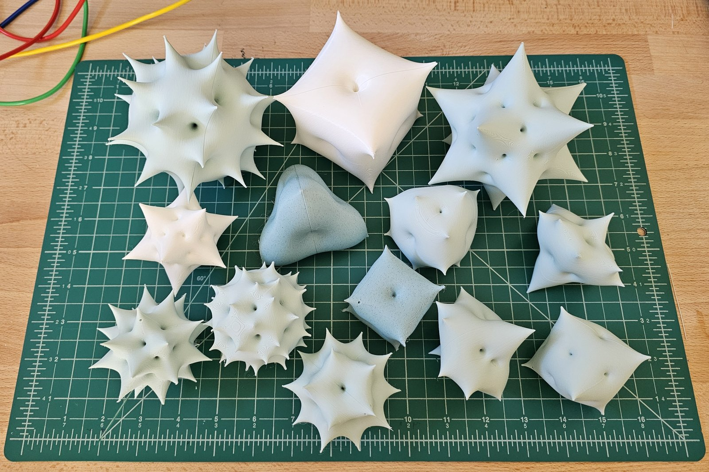

# Polyhedra as complex functions

A convex polyhedron is a finite, rigid object. A rational function on the Riemann sphere is
determined by finitely many points, its zeros and its poles. This project translates one into the
other: it places zeros and poles where a polyhedron's vertices, faces and edges point, and studies
the function that results.

<figure markdown>

<figcaption>The printed collection: all ten pieces.</figcaption>
</figure>

The function's modulus pushes the sphere out into a relief: **poles become spikes and zeros
become pits**. On screen, the color is the function's phase:

{ width="32%" }
{ width="32%" }
{ width="32%" }

## Two ways in

**[The objects](objects/index.md).** Start with the things themselves: what each one is, how it
prints, and where to get the files.

**[The question](research/index.md).** Start with the mathematics: what it means to turn a
polyhedron into a function, which recipes do it well, and where they fail.

New to complex numbers? **[Start here](research/primer.md)**: a gentle introduction to the
Riemann sphere, stereographic projection and the reliefs, with figures you can turn and drag.

!!! info "Status"
    The research (Phase 1) is complete, and the exhibition is printed: ten pieces, each with
    print files linked from its page and gathered in one
    [Printables collection](https://www.printables.com/@Igor_2829688/collections/3812430).
