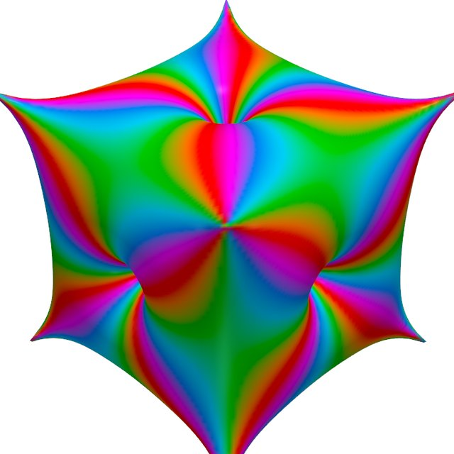
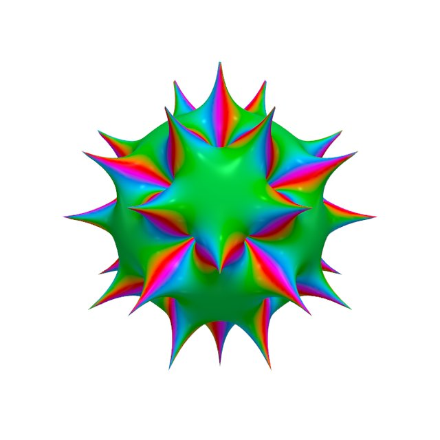
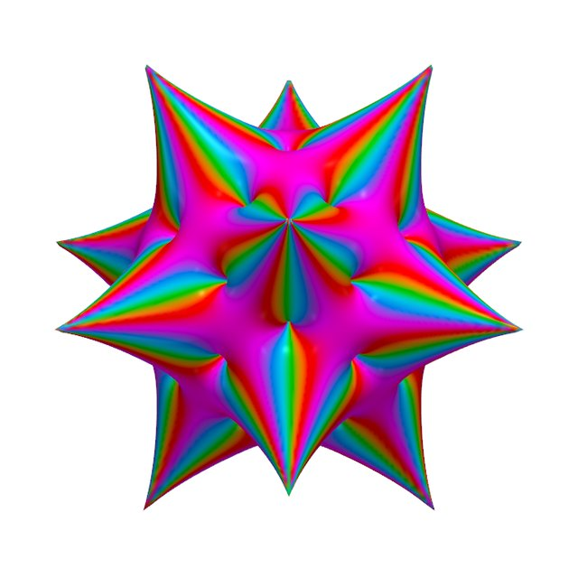

# Polyhedra as complex functions

A convex polyhedron is a finite, rigid object. A rational function on the Riemann sphere is
determined by finitely many points, its zeros and its poles. This project translates one into the
other: it places zeros and poles where a polyhedron's vertices, faces and edges point, and studies
the function that results.

{ width="32%" }
{ width="32%" }
{ width="32%" }

The function's modulus pushes the sphere out into a relief: **poles become spikes and zeros
become pits**. The color is the function's phase. Each relief can be 3D-printed.

## Two ways in

**[The objects](objects/index.md).** Start with the things themselves: what each one is, how it
prints, and where to get the files.

**[The question](research/index.md).** Start with the mathematics: what it means to turn a
polyhedron into a function, which recipes do it well, and where they fail.

!!! info "Status"
    The research (Phase 1) is complete. The exhibition is being printed and photographed, and
    print files will be linked from each object's page as they are published.
