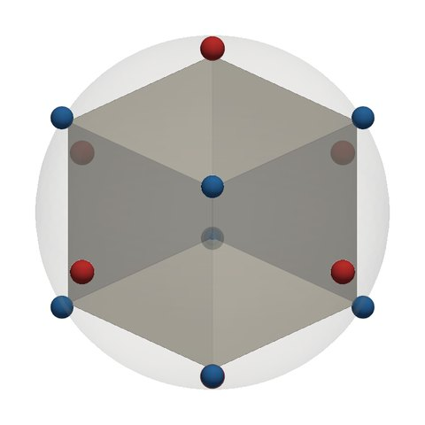
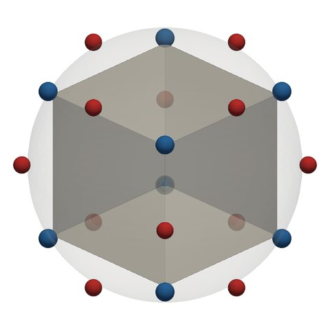

# Compare recipes

Choose a solid and a recipe on each side to see where each recipe puts its zeros (blue) and
poles (red). The two views share one orientation: drag either one to turn both. Scroll or pinch to
zoom. Hover over or tap a marker to see its order and the cell it stands for.

*The interactive comparison needs JavaScript and WebGL. Below is its default view, as still
images: the cube under R2 and under R4ve. Every solid and recipe is drawn in the
[comparison atlas](experiments.md#e001-the-comparison-atlas).*

<figure markdown>

<figcaption>R2 on the cube: zeros at the 8 vertices, poles at the 6 faces.</figcaption>
</figure>
<figure markdown>

<figcaption>R4ve on the cube: the same zeros, poles moved to the 12 edges.</figcaption>
</figure>

 zeros (pits)
 poles (spikes). Markers grow with order; in the interactive
view both sides share one size scale, so equal orders give equal markers.

**What is shown.** Each marker is a point of the recipe's divisor, at the direction of the cell
it stands for: a vertex, a face's outward normal, or the foot of the perpendicular to an edge
([the recipes](recipes.md)). Orders are **unreduced** by default, as the recipes are defined. If a
solid's orders share a common factor, the summary says so, and *Reduce by gcd* divides it out.
The points stay the same; only the orders, and so the marker sizes, change. The solids are scaled
to circumradius 1, and the data is computed from the same code as the rest of the site when the
site is built.

## Comparisons to try

With the interactive view running, each name below loads that pair.

- <button type="button" disabled data-compare="a=cube:R2&b=cube:R4ve&link=1&reduce=0">Cube: R2 and R4ve</button>.
  The zeros are the same. R4ve moves the poles from the faces to the edges.
- <button type="button" disabled data-compare="a=cube:R4ve&b=cube:R4fe&link=1&reduce=0">Cube: R4ve and R4fe</button>.
  The two halves of R2: for unreduced divisors, \(D_{R2} = D_{R4ve} - D_{R4fe}\), and the edge
  poles cancel.
- <button type="button" disabled data-compare="a=cube:R2&b=octahedron:R2&link=0&reduce=0">R2 on the cube and on the octahedron</button>.
  Polar duals: the zeros and poles swap places, so one function is the reciprocal of the other.
- <button type="button" disabled data-compare="a=cube:R1&b=cube:R2&link=1&reduce=0">Cube: R1 and R2</button>.
  The same points. On the cube, R1's orders are exactly twice R2's; tick *Reduce by gcd* to see
  that they give the same function.
- <button type="button" disabled data-compare="a=hexagonal-pyramid:R1&b=hexagonal-pyramid:R2&link=1&reduce=1">Hexagonal pyramid: R1 and R2</button>.
  The same points again, but the apex has valence 6 and the base vertices 3. R2 weights them
  differently, while R1 does not.
- <button type="button" disabled data-compare="a=irregular-separated:R2&b=irregular-separated:R4ve&link=1&reduce=0">Irregular solid: R2 and R4ve</button>.
  A solid without symmetry. Its vertices have valences 3, 4 and 5, and its faces 3, 4 and 5
  sides, so R2's markers vary in size. R4ve's 18 edge poles all have order 2.

