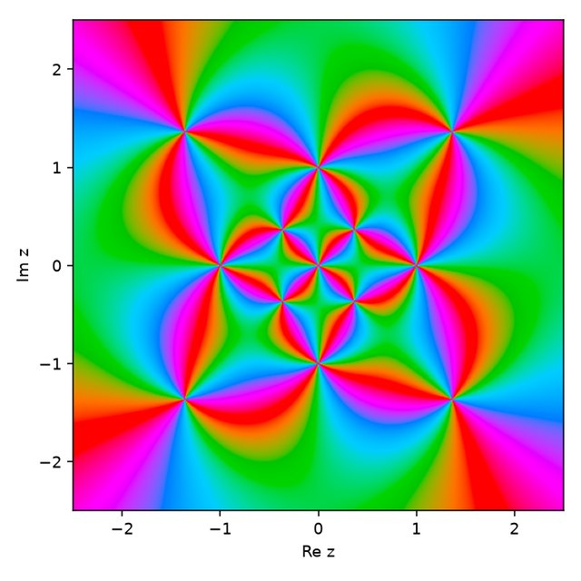
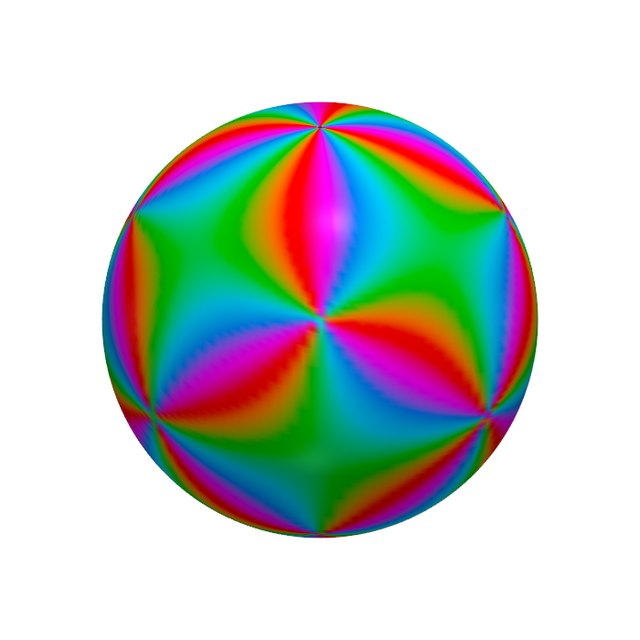

# Start here: the Riemann sphere

The rest of this site talks about rational functions on the Riemann sphere, zeros and poles, and
reliefs. This page builds those ideas from the ground up, assuming only coordinates in the plane.
Nothing here is new: it is standard background **[E]**, with figures you can turn and drag.

## 1. Numbers as points

A complex number \(z = x + iy\) is a point \((x, y)\) of the plane. Two numbers describe where it
is:

- its **modulus** \(|z| = \sqrt{x^2 + y^2}\), the distance from \(0\);
- its **phase** \(\arg z\), the angle from the positive \(x\) axis, counterclockwise.

Complex numbers can be added, multiplied and divided much like ordinary numbers. Multiplying by
\(z\) scales by \(|z|\) and turns by \(\arg z\).

## 2. Functions, zeros and poles

A function \(f\) takes each point \(z\) to a new number \(f(z)\). Since the result is a number in
a plane, we cannot draw a graph as we would for \(y = x^2\). Instead we **color** each point \(z\)
by the phase of \(f(z)\). This is called *domain coloring*. For \(f(z) = z\), the picture is
just the color wheel: each direction from \(0\) gets its own color.

This site works with **rational functions**, one polynomial divided by another, such as
\(z^2\), \(1/z\) or \((z - 1)/(z + 1)\). They have two kinds of special points:

- a **zero**, where \(f = 0\), such as \(z = 1\) for \((z - 1)/(z + 1)\);
- a **pole**, where \(f\) grows without bound, such as \(z = -1\) for the same function.

Each has an **order**, a whole number that says how strongly. \(z^2\) has a zero of order 2 at
\(0\), and \(1/z^3\) a pole of order 3. The coloring shows the order. Walk once around a zero of
order \(m\), counterclockwise, and the colors run through the whole wheel \(m\) times. Around a
pole of order \(m\) they run through it \(m\) times in the opposite direction.

*The interactive figure needs JavaScript. Here is the same kind of picture for one of the
printed pieces, the [cube–octahedron dual](../objects/cube-octahedron-dual.md): the colors wind
one way around its zeros and the other way around its poles.*

{ width="320" }

Choose \(z^2\) in the menu: the colors now wind twice around \(0\). Choose
\((z - 1)/(z + 1)\): one zero (blue dot) and one pole (red dot), winding in opposite directions.

## 3. The trouble with infinity

Look at \(f(z) = z\) again. It has a zero at \(0\), but where is its pole? As \(z\) moves away,
\(f(z)\) grows without bound, yet no point of the plane is "far enough". It is natural to say the
pole sits at a point **\(\infty\)**, which the plane does not contain.

**Stereographic projection** supplies that point. Put a sphere of radius 1 with its centre at
\(0\), so that the plane cuts it along the equator. Join any point \(z\) of the plane to the
**north pole** by a straight line. That line crosses the sphere at exactly one more point: the
**image** of \(z\).

*The interactive figure needs JavaScript and WebGL. A cross-section through the north pole:*

<figure markdown>
<svg class="primer__svg" viewBox="0 0 400 270" role="img" aria-label="Cross-section of stereographic projection: the circle of radius 1, the plane through its centre, and lines from the north pole through two points of the plane to their images on the circle">
  <line x1="10" y1="150" x2="395" y2="150" stroke="#888" stroke-width="1.5"/>
  <circle cx="200" cy="150" r="100" fill="#c9d4e6" fill-opacity="0.35" stroke="#222" stroke-width="1.5"/>
  <line x1="200" y1="50" x2="380" y2="150" stroke="#333" stroke-width="1.2"/>
  <line x1="200" y1="50" x2="280" y2="210" stroke="#333" stroke-width="1.2"/>
  <circle cx="200" cy="50" r="4.5" fill="#222"/>
  <circle cx="200" cy="250" r="4.5" fill="#222"/>
  <circle cx="380" cy="150" r="5" fill="#d9822b"/>
  <circle cx="250" cy="150" r="5" fill="#d9822b"/>
  <circle cx="284.9" cy="97.2" r="5" fill="#6b3fa0"/>
  <circle cx="280" cy="210" r="5" fill="#6b3fa0"/>
  <text x="212" y="44" font-size="14">N = ∞</text>
  <text x="212" y="264" font-size="14">S = 0</text>
  <text x="368" y="172" font-size="14">z</text>
  <text x="240" y="172" font-size="14">w</text>
  <text x="292" y="92" font-size="14">image of z</text>
  <text x="290" y="226" font-size="14">image of w</text>
</svg>
<figcaption>z lies outside the unit circle, so its image is in the northern half. w lies inside, so
its image is in the southern half.</figcaption>
</figure>

Drag the orange point \(z\), or use the sliders, and watch its image (purple):

- \(z = 0\) goes to the **south pole**;
- the **unit circle** \(|z| = 1\) stays where it is: it *is* the equator;
- points **inside** the unit circle go to the southern hemisphere, and points **outside** it to
  the northern one;
- as \(z\) moves away in any direction, its image climbs towards the **north pole**. Press
  *Send z towards ∞* to see it happen.

Every point of the plane gets exactly one point of the sphere, and every point of the sphere
except the north pole comes from exactly one point of the plane. The north pole is the one
missing point, and it plays the role of \(\infty\). The sphere is the plane with that point added
**[E]**. The grid shows how the plane's circles around \(0\) become circles of latitude, and its
rays from \(0\) become meridians.

This is the convention used across the site: \(z = 0\) is the south pole, \(z = \infty\) the
north pole, and \(|z| = 1\) the equator.

## 4. The Riemann sphere

The plane with \(\infty\) added, pictured as this sphere, is the **Riemann sphere**. A rational
function is at home on it. Every point, \(\infty\) included, has a value, and that value may
itself be \(\infty\). So the coloring of the plane can be carried over to the sphere, point by
point.

*The interactive figure needs JavaScript and WebGL. Here is the cube–octahedron dual, in the
plane and on the sphere.*

{ width="48%" }
{ width="48%" }

Things to try:

- **\(f(z) = z\)**: a zero at the south pole and a pole at the north pole. The pole that had no
  place in the plane is now an ordinary point.
- **\(1/z\)**: the same two points, with zero and pole swapped.
- **\(z^3 - 1\)**: three zeros on the equator, at the cube roots of 1. A polynomial of degree
  \(d\) has a pole of order \(d\) at \(\infty\), here of order 3.
- In every case the zeros and the poles **balance**. Counted with their orders, there are as many
  zeros as poles, once \(\infty\) is included **[E]**.

A rational function is fixed, up to a constant factor, by where its zeros and poles are and by
their orders **[E]**. This is what the project builds on. Choose the points from a polyhedron,
for example a zero at each corner of a cube and a pole above the middle of each face, and you
get a function that "is" the cube. The last menu entry, *R2 on the cube*, is exactly that:
recipe R2, the site's default, explained on [the recipes page](recipes.md).

## 5. From color to shape: the relief

Color shows the phase of \(f\). The other half of each value, the modulus \(|f|\), can be shown
as **shape**. Move each point of the sphere outwards where \(|f|\) is large and inwards where it
is small:

- near a **pole**, \(|f|\) grows without bound, so the surface rises into a **spike**;
- near a **zero**, \(|f|\) falls to 0, so the surface sinks into a **pit**;
- where \(|f| = 1\), the surface stays at "**sea level**", the original sphere.

*The interactive figure needs JavaScript and WebGL. Here is the colored sphere of the
cube–octahedron dual and its printed relief.*

{ width="48%" }
{ width="48%" }

Move the *relief* slider from 0 to 1 to push the sphere out by \(|f|\). Untick *Sea level* to
hide the white sphere of radius 1.

Since \(|f|\) runs from 0 to infinity, the radius cannot simply equal \(|f|\). It goes through a
smooth S-shaped curve of \(\log|f|\) instead:

$$
r \;=\; d + \frac{1 - d}{1 + e^{-\log|f| / k}},
$$

where \(d\) is the bottom of the deepest pit and \(k\) sets how sharp the features are. Sea level
\(|f| = 1\) gives \(\log|f| = 0\), exactly halfway. The figure uses \(d = 0.2\) and sets \(k\) to
twice the highest order, so that spikes of every order look comparably sharp. The figure scales
sea level to radius 1. The printed pieces are shaped the same way, with transfer settings chosen
for each piece.

Where sea level falls depends on the constant factor in front of \(f\), which the zeros and poles
leave open. The site always chooses it so that the average of \(\log|f|\) over the sphere is 0.
[The exploration](narrative.md#2-the-construction-space) explains why **[D]**. For \(z\), \(z^2\),
\(1/z\) and \((z - 1)/(z + 1)\), that choice is the plain function itself. For \(z^3 - 1\) it is
the function times a positive constant.

## Where next

- **[The objects](../objects/index.md):** the printed reliefs, each with its sphere, plane and
  3D views like the ones above.
- **[The recipes](recipes.md):** the rules that turn a polyhedron into zeros and poles.
- **[Compare recipes](compare.md):** two recipes side by side on any of the test solids.
